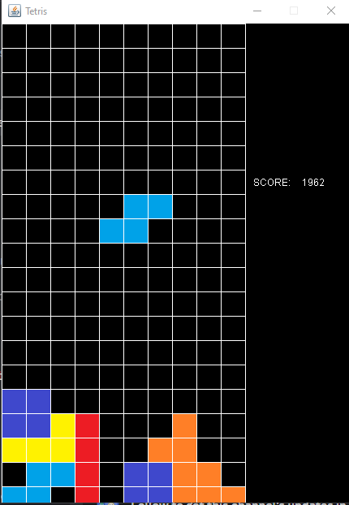

# Tetris Game in Java



This is a simple implementation of the classic game Tetris using Java. It provides a basic command-line interface for playing the game.

## Getting Started

### Prerequisites

To run this Tetris game, you will need:

- Java Development Kit (JDK 21) installed on your system
- Git (optional, for cloning the repository)

### Clone the Repository

You can clone this repository using Git:

```bash
git clone https://github.com/yourusername/tetris-java.git
```
Compile and Run
Navigate to the project directory and compile the Java source files:

```bash
javac Tetris.java
```
Then, run the game:

```bash
java Tetris
```
How to Play
Use the A and D keys to move the Tetrimino left and right.
Press the W key to rotate the Tetrimino.
Use the S key to drop the Tetrimino faster.

The goal of the game is to complete lines by filling them with Tetriminoes. Completed lines will be removed, and you earn points. The game ends when Tetriminoes reach the top of the playfield.

Features
Classic Tetris gameplay.
Score tracking.
